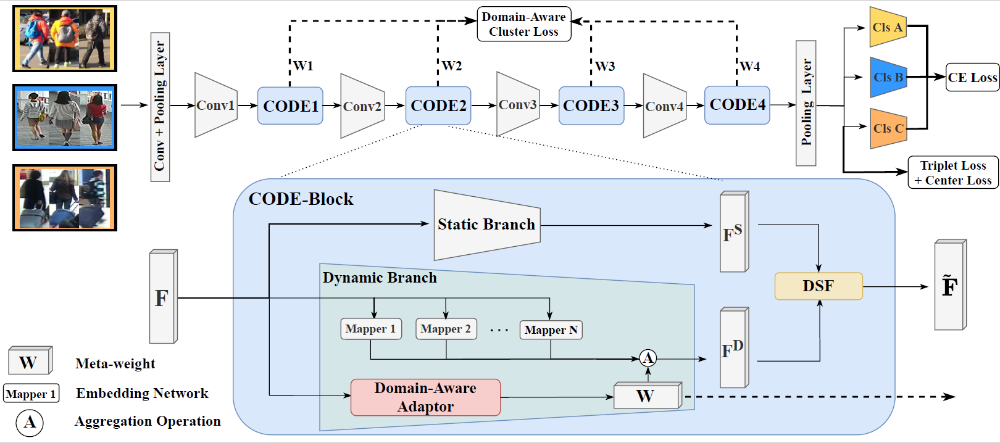

# Adaptive Cross-Domain learning for Generalizable Person Re-Identification


## Requirements
+ CUDA>=10.0
+ At least four 1080-Ti GPUs
+ Setup could refer to [INSTALL.md](INSTALL.md)
+ Other necessary packages listed in [requirements.txt](requirements.txt)
+ Training Data \
The model is trained and evaluated on Market-1501, MSMT17, cuhkSYSU, CUHK03. Download for these datasets, please refer to [fast-reid](https://github.com/JDAI-CV/fast-reid).
## Run

```
  # train
  python copy_launch.py

  # test
  python3 tools/train_net.py --config-file ./configs/bagtricks_DR50_mix.yml --eval-only MODEL.WEIGHTS /path/to/checkpoint_file MODEL.DEVICE "cuda:0"
```
## Acknowledgments
This repo borrows partially from [fast-reid](https://github.com/JDAI-CV/fast-reid), and [MetaBIN](https://github.com/bismex/MetaBIN).